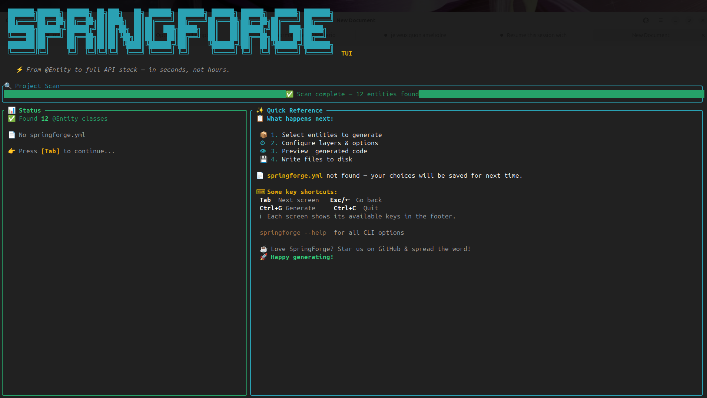
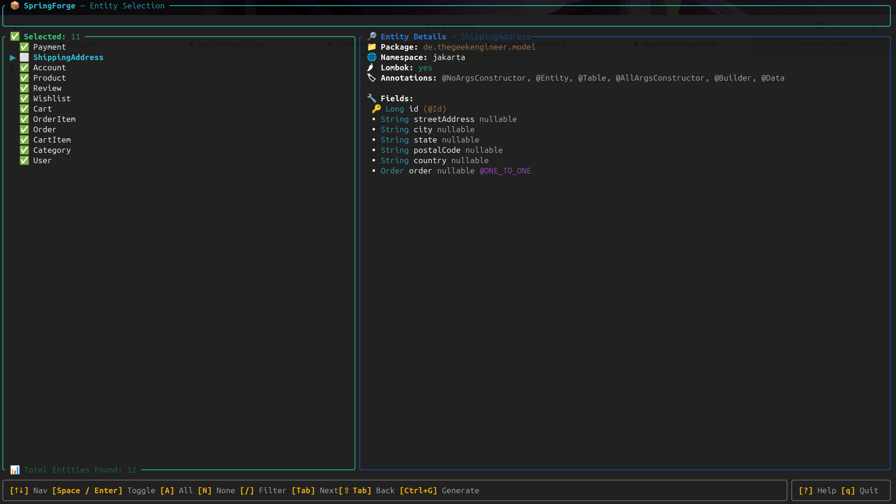
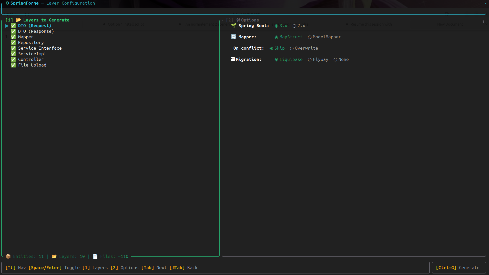
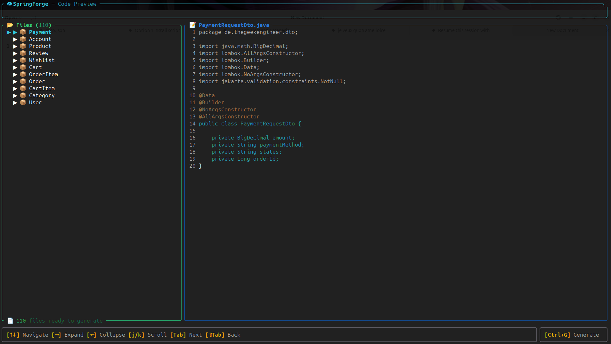
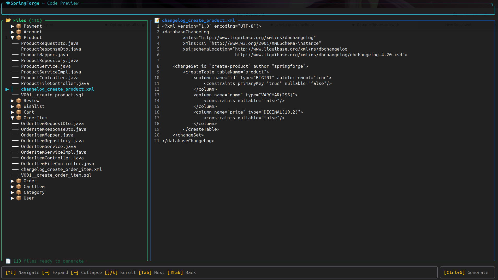
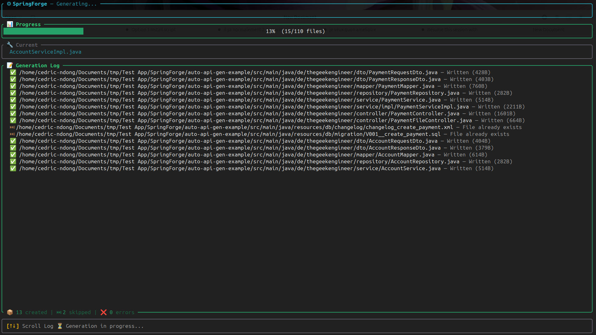
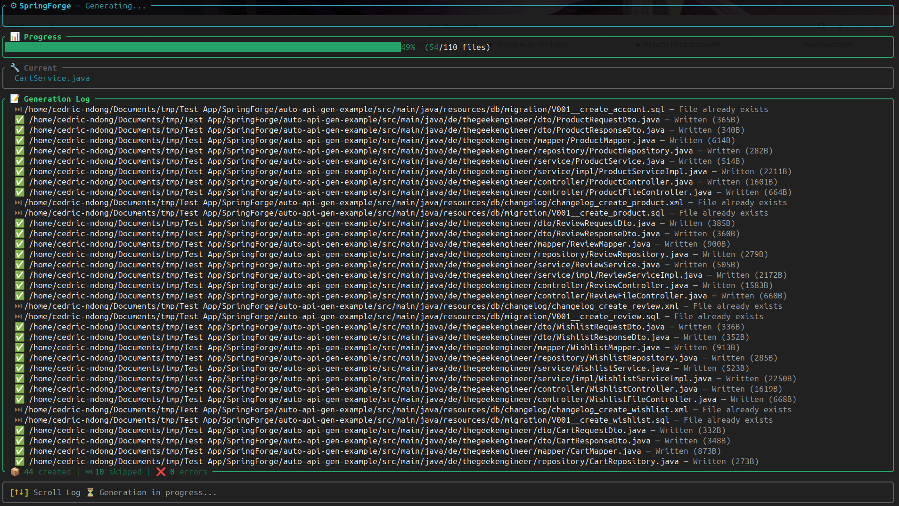
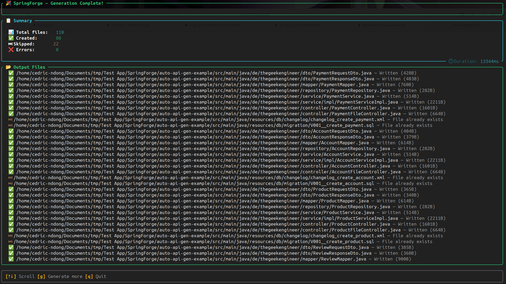

# SpringForge TUI

> *"The full power of API Generator — in your terminal, for every developer, on every machine."*

[](https://github.com/CedricNdong/springforge-tui)
[](https://openjdk.org/projects/jdk/21/)
[](https://github.com/CedricNdong/springforge-tui/actions)
[](LICENSE)

SpringForge TUI is a **terminal-first, IDE-agnostic CLI tool** that parses your Spring Boot `@Entity` classes and generates a complete, production-ready API stack in seconds.

No special IDE required. Works on VS Code, Neovim, remote servers, and CI/CD pipelines.

---

## Table of Contents

- [Screenshots](#screenshots)
- [What it generates](#what-it-generates)
- [Tech Stack](#tech-stack)
- [Installation](#installation)
- [Quick Start](#quick-start)
- [Usage](#usage)
- [Configuration](#configuration)
- [Project Structure](#project-structure)
- [Development](#development)
- [Contributing](#contributing)
- [License](#license)

---

## Screenshots

### S1 — Splash / Scan

The splash screen displays the SpringForge logo and scans your project for `@Entity` classes.



### S2 — Entity Selection

Browse all discovered entities with a detail panel showing fields, types, annotations, and relationships. Filter, select/deselect individually or in bulk.



### S3 — Layer Configuration

Choose which layers to generate and configure options: Spring Boot version, mapper library, and conflict strategy.



### S4 — Code Preview

Review every generated file before writing to disk. Navigate between files and scroll through the code with syntax highlighting.





### S5 — Generation Progress

Real-time progress bar with per-file status log showing created, skipped, and errored files.





### S6 — Summary

Final report with file counts, duration, and a complete list of generated files.



---

## What it generates

From your `@Entity` classes, SpringForge generates:

| Layer | Output |
|-------|--------|
| DTO (Request + Response) | Proper relationship flattening, circular ref handling |
| Mapper | MapStruct or ModelMapper |
| Repository | Spring Data JPA |
| Service + ServiceImpl | Full CRUD with pagination |
| REST Controller | GET, POST, PUT, DELETE + paginated list |
| File Upload Controller | Multipart file upload endpoint |
| Liquibase migration | XML changelog |
| Flyway migration | SQL migration script |

Handles `@ManyToOne`, `@OneToMany`, `@ManyToMany`, `@OneToOne`, circular references, Lombok detection, and Spring Boot 2/3 namespace switching automatically.

---

## Tech Stack

| Component | Technology | Version |
|-----------|------------|---------|
| Language | Java | 21 LTS |
| CLI Framework | Picocli | 4.7+ |
| TUI Framework | TamboUI | 0.2.0-SNAPSHOT (pinned) |
| AST Parser | JavaParser | 3.25+ |
| Template Engine | Mustache.java | 0.9.x |
| Config Parsing | Jackson YAML | 2.x |
| Build Tool | Gradle (Groovy DSL) | 8.x |
| Native Build | GraalVM native-image | 25+ |
| Testing | JUnit 5 + AssertJ | Latest |
| Integration Testing | Testcontainers (PostgreSQL) | 1.20.x |
| Code Quality | Checkstyle + SpotBugs | Latest |

---

## Installation

### Option 1 — Native binary (recommended)

Download the latest release for your platform:

```bash
# Linux (x86_64)
curl -L https://github.com/CedricNdong/springforge-tui/releases/latest/download/springforge-linux-x86_64 -o springforge
chmod +x springforge
sudo mv springforge /usr/local/bin/

# macOS (Apple Silicon)
curl -L https://github.com/CedricNdong/springforge-tui/releases/latest/download/springforge-macos-aarch64 -o springforge
chmod +x springforge
sudo mv springforge /usr/local/bin/
```

Or use the install script:

```bash
curl -L https://github.com/CedricNdong/springforge-tui/releases/latest/download/install.sh | bash
```

### Option 2 — Fat JAR (requires Java 21+)

Download `springforge-tui-*-all.jar` from the [releases page](https://github.com/CedricNdong/springforge-tui/releases) and run:

```bash
java -jar springforge-tui-*-all.jar generate --help
```

---

## Quick Start

1. Navigate to your Spring Boot project root:

```bash
cd /path/to/your/spring-boot-project
```

2. Generate all API layers for all detected entities:

```bash
springforge generate --all
```

SpringForge auto-scans `src/main/java/` for `@Entity` classes and generates DTOs, Mappers, Repositories, Services, and Controllers.

3. Preview what would be generated without writing files:

```bash
springforge generate --all --dry-run
```

### Targeting specific entities

```bash
# Single entity file
springforge generate --entity src/main/java/com/example/model/User.java --all

# Multiple entity files
springforge generate --entities User.java Product.java Order.java --all

# Scan a specific directory
springforge generate --dir src/main/java/com/example/model --all
```

---

## Usage

```bash
# Generate all layers for all entities
springforge generate --all

# Generate only DTOs and Mappers
springforge generate --dto --mapper

# Generate with ModelMapper instead of MapStruct
springforge generate --all --mapper-lib modelmapper

# Target Spring Boot 2.x (uses javax.* namespace)
springforge generate --all --spring-version 2

# Generate to a custom output directory
springforge generate --all --output /tmp/generated

# Overwrite existing files (default: skip)
springforge generate --all --overwrite

# Dry run — preview without writing files
springforge generate --all --dry-run
```

### All flags

| Flag | Description |
|---|---|
| `-e, --entity <file>` | Single Java entity file |
| `-E, --entities <files...>` | Multiple Java entity files |
| `-d, --dir <dir>` | Scan directory for `@Entity` classes |
| `--all-entities` | Auto-discover all `@Entity` classes in `src/` |
| `--all` | Generate all layers |
| `--dto` | Generate DTO classes only |
| `--mapper` | Generate mapper only |
| `--repository` | Generate repository only |
| `--service` | Generate service + impl only |
| `--controller` | Generate controller only |
| `--migration` | Generate database migration only |
| `--dry-run` | Show what would be generated without writing |
| `--overwrite` | Overwrite existing files (default: skip) |
| `-o, --output <dir>` | Override output base directory |
| `--spring-version <2\|3>` | Target Spring Boot version (default: 3) |
| `--mapper-lib <lib>` | Mapper library: `mapstruct` or `modelmapper` |
| `--db-migration <tool>` | Migration tool: `liquibase` or `flyway` |
| `--no-tui` | Non-interactive pipeline mode |

---

## Configuration

Create a `springforge.yml` at your project root:

```yaml
version: "1.0"

project:
  basePackage: com.example.myapp
  srcDir: src/main/java
  resourceDir: src/main/resources
  springBootVersion: "3"          # "2" or "3"

generation:
  mapperLib: mapstruct            # mapstruct | modelmapper
  migrationTool: none             # liquibase | flyway | none
  openApiFormat: none             # yaml | json | none
  onConflict: skip                # skip | overwrite
  lombok: true

naming:
  apiPrefix: /api
  apiVersion: v1
```

Config resolution order (highest to lowest priority):

1. CLI flags
2. `--config <path>` — explicitly passed config file
3. `./springforge.yml` in project root
4. Built-in defaults

---

## Project Structure

```
springforge-tui/
├── springforge-cli/               ← Picocli commands, entry points
├── springforge-tui-screens/       ← TamboUI screen implementations + TuiRenderer
├── springforge-engine/            ← Core: scanner, parser, renderer, writer
├── springforge-templates/         ← 11 Mustache templates (built-in)
├── springforge-config/            ← springforge.yml parsing + config resolution
└── springforge-integration-tests/ ← E2E tests with Testcontainers PostgreSQL
```

---

## Development

### Prerequisites

- Java 21+
- Docker (for integration tests with Testcontainers)
- GraalVM 25+ (optional, for native binary)

### Build from source

```bash
# Build all modules
./gradlew build

# Run unit tests
./gradlew test

# Run integration tests (requires Docker)
./gradlew :springforge-integration-tests:integrationTest

# Run locally
./gradlew :springforge-cli:run --args="generate --help"
```

### Build distributable artifacts

```bash
# Fat JAR
./gradlew :springforge-cli:fatJar

# Native binary (requires GraalVM)
./gradlew :springforge-cli:nativeCompile
```

---

## Contributing

Contributions are welcome! Here's how to get started:

1. Fork the repository
2. Create a feature branch from `develop`
   ```bash
   git checkout develop
   git checkout -b feature/my-feature
   ```
3. Make your changes
4. Run tests to verify
   ```bash
   ./gradlew test
   ```
5. Commit using [Conventional Commits](https://www.conventionalcommits.org/)
   ```bash
   git commit -m "feat(engine): add support for custom templates"
   ```
6. Push to your branch
   ```bash
   git push origin feature/my-feature
   ```
7. Open a Pull Request **targeting `develop`** (not `main`)

> PRs targeting `main` directly will be rejected by CI. Only `develop` can be merged into `main`.

If you find a bug or have a feature request, please [open an issue](https://github.com/CedricNdong/springforge-tui/issues).

See [CONTRIBUTING.md](CONTRIBUTING.md) for full details on branching strategy, commit conventions, and definition of done.

---

## Documentation

| Document | Description |
|----------|-------------|
| [PRD](docs/PRD.md) | Product requirements, milestones, current status |
| [Technical Design](docs/TECHNICAL_SPEC.md) | Architecture, data models, implementation details |
| [Contributing](CONTRIBUTING.md) | Branching strategy, commit conventions |

---

## License

MIT © Cedric Ndong
